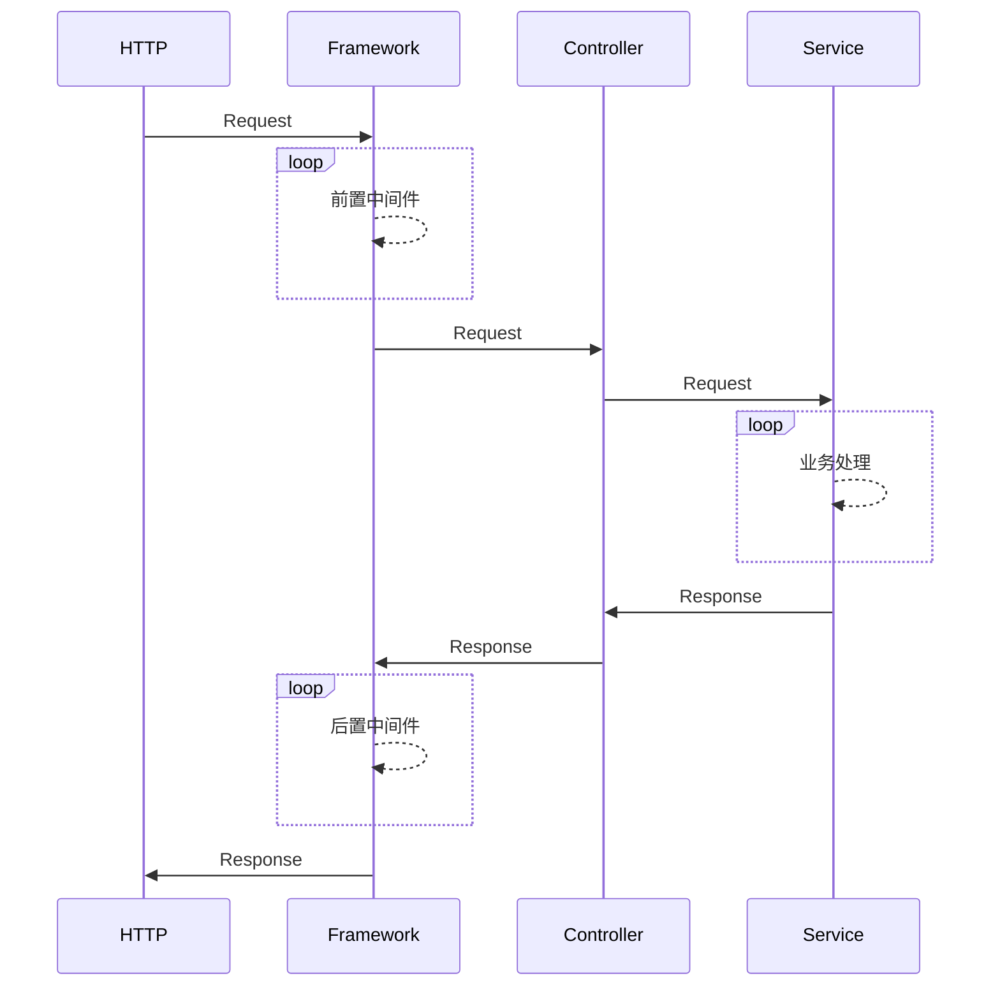

```mermaid // TODO
%% 时序图例子,-> 直线，-->虚线，->>实线箭头
  sequenceDiagram
    participant HTTP
    participant Framework
    participant Controller
    participant Service
    HTTP ->> Framework: Request
    loop
        Framework -->> Framework: 前置中间件
    end
    Framework ->> Controller: Request
    Controller ->> Service: Request
    loop
        Service -->> Service: 业务处理
    end
	Service ->> Controller: Response
	Controller ->> Framework: Response
    loop
        Framework -->> Framework: 后置中间件
    end
    Framework ->> HTTP: Response
```