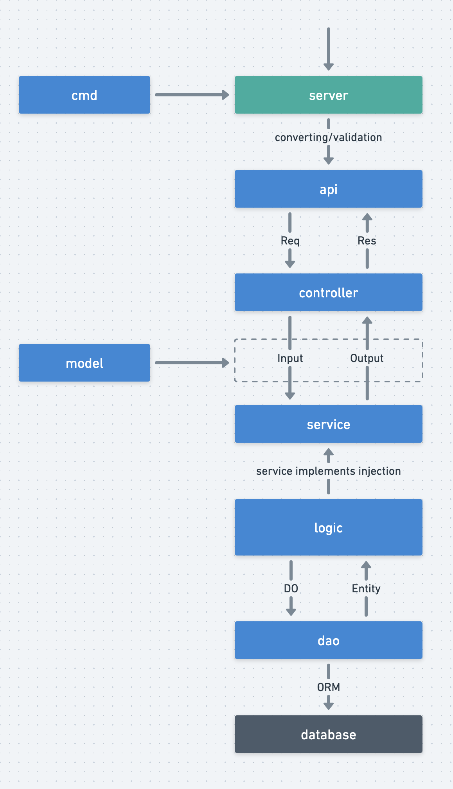

> 源代码/数据集已上传到：[GitHub - follow gee to learn go](https://github.com/niluan304/gee)

## 什么是请求分层流转

在阐述为什么需要分层设计之前，笔者想先介绍一下分层流转[^1]：
[^1]:[工程目录设计🔥 - GoFrame (ZH)](https://goframe.org/pages/viewpage.action?pageId=30740166)


分层之后，可以让每一层的专注于一类事，这类似于设计模式里单一职责的思想，可以提高项目的可维护性，与接口的可复用性，从而实现低耦合高内聚。计算机网络中的「TCP/IP 四层模式」就是非常典型的分层，实现从 `HTTP` 到 `HTTPS` 的升级，只需要在 `HTTP` 协议与 `TCP` 中加了一层 `TLS`，其他层的协议与应用不需要做任何改动，这就是计算机网络模型低耦合高内聚的表现。


## 代码纠缠的困境
这里有一份简单的 `CURD` 代码，只有 `*user.Get`、`*team.Get` 两个接口，和对应的数据库表 `UserTable`、`TeamTable`，功能也很简单，根据表主键，获取对应的行数据：
```go
// ./internal/api.go

type Response struct {
	Code int    `json:"code"` // 业务代码，200 表示 OK，其他表示错误
	Msg  string `json:"msg"`  // 错误消息
	Data any    `json:"data"` // 返回的数据
}

const (
	CodeOK         = 200
	CodeBadRequest = 400
)

type user struct{}

var User = &user{}

func (c *user) Get(ctx *gin.Context) {
	var req *struct {
		Id int `uri:"id"`
	}
	err := ctx.ShouldBindUri(&req)
	if err != nil {
		ctx.JSON(http.StatusOK, Response{CodeBadRequest, err.Error(), nil})
		return
	}

	i := slices.IndexFunc(db.Users, func(row db.User) bool { return row.Id == req.Id })
	if i == -1 { // 数据库未找到数据
		ctx.JSON(http.StatusOK, Response{CodeBadRequest, fmt.Sprintf("user not found: %d", req.Id), nil})
		return
	}

	// 返回数据库内容
	row := db.Users[i] // Users 只是一个切片 []User，用于充当数据库表
	ctx.JSON(http.StatusOK, Response{CodeOK, "", row})
	return
}

type team struct{}

var Team = &team{}

func (c *team) Get(ctx *gin.Context) {
	var req *struct {
		Id int `uri:"id"`
	}
	err := ctx.ShouldBindUri(&req)
	if err != nil {
		ctx.JSON(http.StatusOK, Response{CodeBadRequest, err.Error(), nil})
		return
	}

	// 查询数据
	i := slices.IndexFunc(db.Teams, func(row db.Team) bool { return row.Id == req.Id })
	if i == -1 { // 数据库未找到数据
		ctx.JSON(http.StatusOK, Response{CodeBadRequest, fmt.Sprintf("team not found: %d", req.Id), nil})
		return
	}
	// 返回数据库内容
	row := db.Teams[i] // Teams 只是一个切片 []Team，用于充当数据库表
	ctx.JSON(http.StatusOK, Response{CodeOK, "", row})
	return
}

```

代码很简单，没什么问题，但假如随着项目的进展，需要新增一个接口：通过 `userId` 获取用户信息和用户所在 `Team` 的信息。

返回的数据格式：
```go
type UserWithTeam struct {
	Id   int    `json:"id"`
	Name string `json:"name"`
	Team struct {
		Id   int    `json:"id"`
		Name string `json:"name"`
	} `json:"team"`
}
```

这时候理想的处理办法：
1. 根据 `userId` 通过 `*user.Get` 获取到用户信息和 `teamId`
2. 根据 `teamId` 通过 `*team.Get` 获取用户所在 `Team` 的信息

流程看起来只需要复用先用的接口，就可以实现需求了，比如这样：
```go
func (c *user) GetWithTeam(ctx *gin.Context) {
	c.Get(ctx)
	Team.Get(ctx)
}
```

如果仅仅是这样的执行顺序，很明显是错误的，用户端通过路由会得到"粘包的 `json`"：
```json
{
    "code": 200,
    "msg": "",
    "data": {
        "Id": 1,
        "Name": "Alice",
        "TeamId": 1
    }
}{
    "code": 400,
    "msg": "team not found: 1",
    "data": null
}
```

分析一下原因，
1. 首先 `*gin.Context` 通过路由接收到的数据，只有 `userId` 这个数据，并不包含 `teamId`，而需要的 `teamId` 在 `*user.Get` 接口内部直接写到了 `(*gin.Context).JSON` 中。
2. 即便有办法获取传入 `(*gin.Context).JSON` 的数据，还需要改造 `*gin.Context`，让 `*team.Get` 也能获取到正确的 `teamId`，但是修改 `*gin.Context` 内部数据是很危险的一件事，稍有不慎，就可能跌落悬崖。

如果 `*user.Get` 和 `*team.Get`  的设计是传入 `id`，返回对应信息，那么就可以轻松实现新接口，还能规避修改 `*gin.Context`，比如这样：
```go
func GetWithTeam(ctx *gin.Context) {
	user := User.Get(id)
	team := Team.Get(user.TeamId)

	// 组装数据，写入返回
	// ...
}
```

这其实就运用到计算机网络模型里经典的分层思想，将共同属性的分到同一层，通过上下层的「封包」和「解包」实现解耦。现在比较流行的纯后端 API 模块一般采用下述划分方法[^2]
[^2]:[大型Web项目分层 - Go语言高级编程](https://chai2010.cn/advanced-go-programming-book/ch5-web/ch5-07-layout-of-web-project.html)：
1. Controller，与上述类似，服务入口，负责处理路由，参数校验，请求转发。
2. Logic/Service，逻辑（服务）层，一般是业务逻辑的入口，可以认为从这里开始，所有的请求参数一定是合法的。业务逻辑和业务流程也都在这一层中。常见的设计中会将该层称为 Business Rules。
3. DAO/Repository，这一层主要负责和数据、存储打交道。将下层存储以更简单的函数、接口形式暴露给 Logic 层来使用。负责数据的持久化工作。

## 分层设计
先介绍下分层后的目录结构：
```sh
.
|-- go.mod
|-- go.sum
|-- internal
|   |-- controller
|   |   `-- controller.go
|   `-- service
|       |-- service.go
|       `-- service_model.go
`-- main.go
```

当业务代码都放到了 `service` 层时，这一层的代码互相调用是不会被 `controller` 层影响的，这也实现了 `Gin` 框架与业务代码的解耦。

`controller` 层的主要代码：
```go
// ./internal/controller/controller.go

func (c *user) Get(ctx *gin.Context) {
	var req *service.UserGetReq
	err := ctx.ShouldBindUri(&req)
	if err != nil {
		ctx.JSON(http.StatusOK, Response{CodeBadRequest, err.Error(), nil})
		return
	}

	res, err := service.User.Get(ctx, req)
	if err != nil {
		ctx.JSON(http.StatusOK, Response{CodeBadRequest, err.Error(), nil})
		return
	}

	// 填写响应内容
	ctx.JSON(http.StatusOK, Response{CodeOK, "", res})
	return
}

func (c *team) Get(ctx *gin.Context) {
	var req *service.TeamGetReq
	err := ctx.ShouldBindUri(&req)
	if err != nil {
		ctx.JSON(http.StatusOK, Response{CodeBadRequest, err.Error(), nil})
		return
	}

	res, err := service.Team.Get(ctx, req)
	if err != nil {
		ctx.JSON(http.StatusOK, Response{CodeBadRequest, err.Error(), nil})
		return
	}

	// 填写响应内容
	ctx.JSON(http.StatusOK, Response{CodeOK, "", res})
	return
}

```

`service` 层的主要代码：
```go
// ./internal/service/service.go

func (s *user) Get(ctx context.Context, req *UserGetReq) (res *UserGetRes, err error) {
	// 查询数据
	i := slices.IndexFunc(db.Users, func(row db.User) bool { return row.Id == req.Id })
	if i == -1 { // 数据库未找到数据
		return nil, fmt.Errorf("user not found: %d", req.Id)
	}

	// 返回数据库内容
	row := db.Users[i] // Users 只是一个切片 []User，用于充当数据库表
	return &UserGetRes{Id: row.Id, Name: row.Name, TeamId: row.TeamId}, nil
}

func (s *team) Get(ctx context.Context, req *TeamGetReq) (res *TeamGetRes, err error) {
	// 查询数据
	i := slices.IndexFunc(db.Teams, func(row db.Team) bool { return row.Id == req.Id })
	if i == -1 { // 数据库未找到数据
		return nil, fmt.Errorf("team not found: %d", req.Id)
	}

	// 返回数据库内容
	row := db.Teams[i] // Teams 只是一个切片 []Team，用于充当数据库表
	return &TeamGetRes{Id: row.Id, Name: row.Name}, nil
}
```

这时候，再来实现一下，新增一个接口：通过 `userId` 获取用户信息和用户所在 `Team` 的信息。
```go
func (c *user) GetWithTeam(ctx *gin.Context) {
	var req *service.UserGetReq
	err := ctx.ShouldBindUri(&req)
	if err != nil {
		ctx.JSON(http.StatusOK, Response{CodeBadRequest, err.Error(), nil})
		return
	}

	userRes, err := service.User.Get(ctx, req)
	if err != nil {
		ctx.JSON(http.StatusOK, Response{CodeBadRequest, err.Error(), nil})
		return
	}

	teamRes, err := service.Team.Get(ctx, &service.TeamGetReq{Id: userRes.TeamId})
	if err != nil {
		ctx.JSON(http.StatusOK, Response{CodeBadRequest, err.Error(), nil})
		return
	}

	type UserWithTeam struct {
		Id   int                `json:"id"`
		Name string             `json:"name"`
		Team service.TeamGetRes `json:"team"`
	}
	// 填写响应内容
	ctx.JSON(http.StatusOK, Response{CodeOK, "", UserWithTeam{
		Id:   userRes.Id,
		Name: userRes.Name,
		Team: *teamRes,
	}})
	return
}
```

分层后的总代码行数有所增加，整个项目的布局变得更清晰了，业务代码也不会受到 web框架的干扰，可以集中处理业务。而且业务层的函数签名具有可读性了，调用 `service` 层的方法时，就可以知道所需要的参数，以及返回的值。不过有些读者可能会有疑问，为什么 `service` 层方法的第一个参数都是 `ctx context.Context`，即便代码中未必使用，这算是 `go` 语言在 web 开发中的特色（也可能是技术债），用于并发控制和上下文信息传递的，有兴趣可以自行了解下。

但是在 `controller` 层有太多的 `(*gin.Context).JSON()`，也就是处理接口的响应，变得异常繁琐，为了解决这一点，笔者将在下一节阐述如何在框架中实现统一错误处理和数据返回。


## 小结
本章节介绍下如何通过「分层设计」将一个大问题，转化为若干的分工明确的小问题，实现业务代码与 web框架解耦，提高系统的拓展性和可维护性，从而实现高内聚低耦合。

- 注意：分层设计也会导致一个问题：新增一个业务接口时，需要改动的文件也会变多，不过这可以通过脚本生成代码缓解。


最后让我们来看看程序的运行结果：
```go
func client() {
	time.Sleep(time.Second) // 等待路由注册

	reqs := []func(host string) (*http.Response, error){
		func(host string) (*http.Response, error) { return http.Get(host + "/user?name=Carol") },
		func(host string) (*http.Response, error) { return http.Get(host + "/user?name=Bob") },
		func(host string) (*http.Response, error) {
			return http.Post(host+"/user", "application/json", bytes.NewBufferString(`{"name":"Carol","age":44,"job":"worker"}`))
		},
		func(host string) (*http.Response, error) { return http.Get(host + "/user?name=Carol") },
	}

	for _, req := range reqs {
		resp, err := req("http://localhost:8080")
		if err != nil {
			fmt.Println("req err", err)
		}

		data, err := io.ReadAll(resp.Body)
		if err != nil {
			fmt.Println("read resp.Body err", err)
		}
		fmt.Println(string(data))
	}

	// Output:
	//
	// {"code":200,"msg":"","data":null}
	// {"code":200,"msg":"","data":{"name":"Bob","age":30,"job":"driver"}}
	// {"code":200,"msg":"","data":null}
	// {"code":200,"msg":"","data":{"name":"Carol","age":44,"job":"worker"}}
}

```
